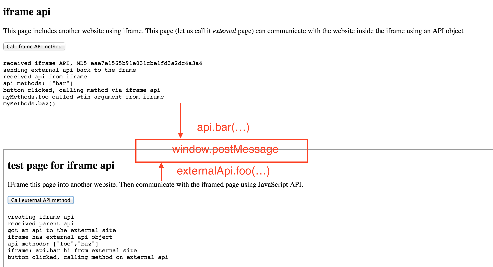

# iframe-api

> Bidirectional API communication between parent window and iframe

[Demo](http://glebbahmutov.com/iframe-api/)

[![NPM][iframe-api-icon] ][iframe-api-url]

[![Build status][iframe-api-ci-image] ][iframe-api-ci-url]
[![dependencies][iframe-api-dependencies-image] ][iframe-api-dependencies-url]
[![devdependencies][iframe-api-devdependencies-image] ][iframe-api-devdependencies-url]

Available on NPM and bower under name `iframe-api`.

## Example

**external website** (index.html)

```html
<script src="iframe-api/dist/external-api.js"></script>
<script>
var myMethods = {
  foo: function (arg) {
    console.log('myMethods.foo called wtih argument', arg);
  },
  version: '0.1.0' // primitive values are also allowed
};
iframeApi(myMethods).then(function (api) {
  api.bar(); // or whatever methods iframed website exposes
}, function (err) {
  console.error('Could not get iframe api', err);
});
</script>
<iframe src="iframed.html"></iframe>
```

**iframed website** (iframed.html)

```html
<script src="iframe-api/dist/iframe-api.js"></script>
<script>
var api = {
  bar: function (message) {
    console.log('iframed called from external', message);
  }
};
iframeApi(api).then(function (externalApi) {
  externalApi.foo('hello world!');
});
</script>
```

**event sequence**

* iframe element loads `iframed.html`
* iframed website loads script built from [src/iframe-api.js](src/iframe-api.js)
* iframed website executed `iframeApi` that posts a message to the parent
    - the payload includes iframe's serialized object `api`
* external website gets the `api` object and makes a call `api.bar()`
* iframed website makes call to the external website using `externalApi.foo` method.

The websites communicate by calling methods on the returned api object, underneath
the we use `window.postMessage`. The iframed website initiates the contact because it knows
when it has been loaded and ready to communicate.



## API

Single function `iframeApi(myApiObject, options)` returns a promise with resolved api object.

* myApiObject
  - can be undefined or null to avoid passing anything to the other side
  - if empty object, the other side will receive empty object
  - can have methods and properties

**api object example**

```js
var myApi = {
  foo: function () {
    this.bar();
  },
  bar: function () {
    console.log('hello', this.name)
  },
  name: 'world'
};
```

* options - optional object with the following properties
  - `debug | verbose` prints console messages during handshake
  - `md5` 
    + if `true` this side will compute md5 checksum of the 
    received source and compare to declared before reviving api object.
    + if a string, takes it as the md5 checksum to be compared against computed.

**options example**

```js
// do not recreate received api, unless its MD5 matches given string
var options = {
  debug: false,
  md5: '845998b5f8907e585c31874ec5cc79a0'
};
```

## Calling remote methods

You can pass arguments to remove API. Each method call returns a promise object

```js
iframeApi(...).then(function (remoteApi) {
  remoteApi.foo('a', 'b', 'c').then(function (result) {
    console.log('remoteApi.foo(a, b, c) returned', result);
  });
});
```

### Small print

Author: Gleb Bahmutov &copy; 2015

* [@bahmutov](https://twitter.com/bahmutov)
* [glebbahmutov.com](http://glebbahmutov.com)
* [blog](http://bahmutov.calepin.co/)

License: MIT - do anything with the code, but don't blame me if it does not work.

Spread the word: tweet, star on github, etc.

Support: if you find any problems with this module, email / tweet /
[open issue](https://github.com/bahmutov/iframe-api/issues) on Github

## MIT License

Copyright (c) 2015 Gleb Bahmutov

Permission is hereby granted, free of charge, to any person
obtaining a copy of this software and associated documentation
files (the "Software"), to deal in the Software without
restriction, including without limitation the rights to use,
copy, modify, merge, publish, distribute, sublicense, and/or sell
copies of the Software, and to permit persons to whom the
Software is furnished to do so, subject to the following
conditions:

The above copyright notice and this permission notice shall be
included in all copies or substantial portions of the Software.

THE SOFTWARE IS PROVIDED "AS IS", WITHOUT WARRANTY OF ANY KIND,
EXPRESS OR IMPLIED, INCLUDING BUT NOT LIMITED TO THE WARRANTIES
OF MERCHANTABILITY, FITNESS FOR A PARTICULAR PURPOSE AND
NONINFRINGEMENT. IN NO EVENT SHALL THE AUTHORS OR COPYRIGHT
HOLDERS BE LIABLE FOR ANY CLAIM, DAMAGES OR OTHER LIABILITY,
WHETHER IN AN ACTION OF CONTRACT, TORT OR OTHERWISE, ARISING
FROM, OUT OF OR IN CONNECTION WITH THE SOFTWARE OR THE USE OR
OTHER DEALINGS IN THE SOFTWARE.

[iframe-api-icon]: https://nodei.co/npm/iframe-api.png?downloads=true
[iframe-api-url]: https://npmjs.org/package/iframe-api
[iframe-api-ci-image]: https://travis-ci.org/bahmutov/iframe-api.png?branch=master
[iframe-api-ci-url]: https://travis-ci.org/bahmutov/iframe-api
[iframe-api-dependencies-image]: https://david-dm.org/bahmutov/iframe-api.png
[iframe-api-dependencies-url]: https://david-dm.org/bahmutov/iframe-api
[iframe-api-devdependencies-image]: https://david-dm.org/bahmutov/iframe-api/dev-status.png
[iframe-api-devdependencies-url]: https://david-dm.org/bahmutov/iframe-api#info=devDependencies
